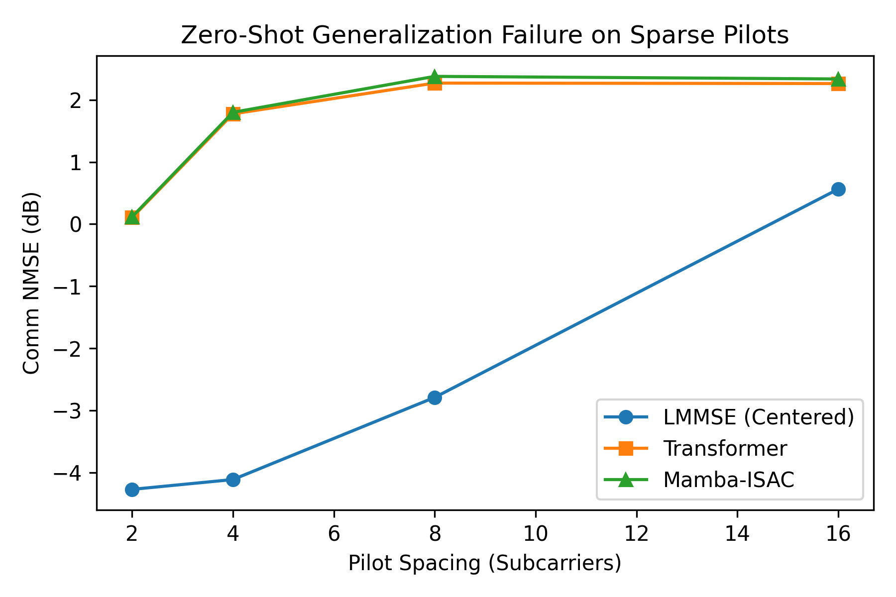

# Mamba-ISAC: Selective State-Space Networks for 6G ISAC (and Where They Break)

[](https://opensource.org/licenses/MIT)
[](https://www.python.org/downloads/)
[](https://pytorch.org/)

**[📄 Read the Full Paper PDF Here](mamba_isac_briefing.pdf)**

Mamba-ISAC is a research framework investigating selective state-space models (SSMs) for joint channel and target parameter estimation in OFDM-based Integrated Sensing and Communication (ISAC) systems.

### The Main Finding: Deep Models Lack Zero-Shot Robustness

When trained on dense pilot data, state-space architectures like Mamba achieve state-of-the-art communication CSI accuracy (-14.77 dB NMSE), drastically outperforming classical LMMSE estimators (-6.72 dB) by learning to cancel residual radar target echo interference.

**However, they completely break down under unseen sparsity.**

When evaluated zero-shot on sparser pilot configurations without explicit training-time augmentation, both Mamba and Transformer completely fail to interpolate the missing data. Their error spikes past +2 dB (worse than random guessing), while the classical LMMSE analytical baseline degrades gracefully.



This repository provides the full, 100% reproducible pipeline (including cryptographically verified checkpoints) demonstrating both the $\mathcal{O}(T)$ linear-time performance advantages of SSMs and this critical robustness limitation.

## Repo Structure

```
mamba-isac/
├── configs/             # YAML configuration files
├── data/                # Rician comm generator, point-target radar generator, pilots
├── models/              # Dual-domain embeddings, Selective Scan Mamba, heads, loss
├── baselines/           # LMMSE estimator, Transformer ISAC baseline
├── eval/                # Metric calculation, evaluation pipelines, ablations
├── utils/               # Reproducibility utilities, FLOPs/param counters
├── tests/               # Pytest suite
├── scripts/             # Plotting & paper figure generation
├── mamba_isac_briefing.tex # IEEEtran LaTeX research paper
├── mamba_isac_checklist.md # Execution checklist
└── mamba_isac_project_overview.md # Project architecture overview
```

## Quick Start

1. Install dependencies:
```bash
pip install -r requirements.txt
```

2. Run test suite:
```bash
pytest
```

3. Generate dataset:
```bash
python generate_dataset.py --config configs/default_config.yaml
```

4. Train Mamba-ISAC model:
```bash
python train.py --config configs/default_config.yaml
```

5. Run full benchmark suite:
```bash
python eval/evaluate_all.py
```

## Citation

If you use this repository in your research, please cite `mamba_isac_briefing.tex`.

```bibtex
@article{mambaisac2026,
  title={Selective State-Space Modeling for Joint Channel Estimation in OFDM-Based Integrated Sensing and Communication: A Mamba-ISAC Framework},
  author={Mamba-ISAC Team},
  journal={Research Proposal / Working Paper},
  year={2026}
}
```
